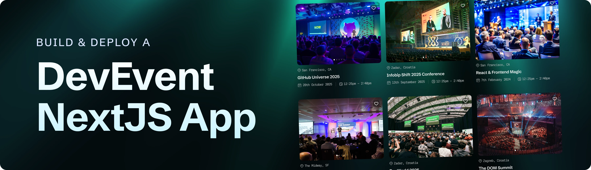

<div align="center">
  <br />
    <a href="https://github.com/your-org/saas" target="_blank">
          
    </a>
  <br />

  <div>
 
 

<br/>
 
  </div>

  <h3 align="center">Dev Event Platform</h3>

   <div align="center">
     A full-stack developer event platform built with Next.js 16, Supabase, and PostHog.
    </div>
</div>

## 📋 <a name="table">Table of Contents</a>

1. ✨ [Introduction](#introduction)
2. ⚙️ [Tech Stack](#tech-stack)
3. 🔋 [Features](#features)
4. 🗄️ [Database Schema](#database-schema)
5. 🤸 [Quick Start](#quick-start)

## <a name="introduction">✨ Introduction</a>

A developer-focused event platform for discovering, creating, and booking events like hackathons, meetups, and conferences. Built with Next.js 16's new `use cache` directive for optimal performance, Supabase as the backend database, and PostHog for analytics and error tracking.

## <a name="tech-stack">⚙️ Tech Stack</a>

- **[Next.js 16](https://nextjs.org/docs)** — React framework with App Router, Server Actions, and the new `use cache` / `cacheLife` APIs. Built with Turbopack.

- **[React 19](https://react.dev/)** — UI library powering both server and client components.

- **[TypeScript](https://www.typescriptlang.org/)** — Static typing across the entire codebase.

- **[Tailwind CSS v4](https://tailwindcss.com/)** — Utility-first CSS framework for rapid styling.

- **[Supabase](https://supabase.com/)** — Postgres-backed backend-as-a-service used for storing events and bookings. Admin and browser clients are used separately with Row Level Security (RLS) policies.

- **[PostHog](https://posthog.com/)** — Product analytics and error tracking, initialized via `instrumentation-client.ts`.

- **[OGL](https://github.com/oframe/ogl)** — Lightweight WebGL library powering the animated light-rays background effect.

- **[Lucide React](https://lucide.dev/)** — Icon library for UI icons.

## <a name="features">🔋 Features</a>

👉 **Home Page** — Fetches and renders upcoming developer events using Next.js `use cache` with an hourly cache lifetime.

👉 **Event Details Page** — Shows full event info (venue, date, mode, agenda, organizer) and similar events matched by shared tags.

👉 **Event Booking** — Users can register for events by email. Duplicate bookings are prevented via a unique constraint.

👉 **Create Event** — A form to submit new developer events into the platform.

👉 **API Routes** — REST endpoints under `/api/events` for fetching and creating events.

👉 **Next.js 16 Caching** — Uses the new `'use cache'` directive and `cacheLife` helper; cache is invalidated via `revalidatePath` on booking.

👉 **PostHog Analytics** — Tracks user interactions and captures exceptions in production.

👉 **Animated Background** — WebGL-powered light-rays effect via the OGL library.

## <a name="database-schema">🗄️ Database Schema</a>

The Supabase schema, RLS policies, and seed data are located in [`database/csv/`](database/csv/):

| File | Purpose |
|------|---------|
| `supabase_schema.sql` | Table definitions for `events` and `booking` |
| `supabase_rls.sql` | Row Level Security policies |
| `supabase_defaults.sql` | Default data |
| `events.csv` / `bookings.csv` | Sample seed data |

**Event fields:** `id`, `title`, `slug`, `description`, `overview`, `image`, `venue`, `location`, `date`, `time`, `mode` (online/offline/hybrid), `audience`, `agenda`, `organizer`, `tags`, `created_at`, `updated_at`

**Booking fields:** `id`, `event_id`, `email`, `created_at`, `updated_at`

## <a name="quick-start">🤸 Quick Start</a>

**Prerequisites**

- [Git](https://git-scm.com/)
- [Node.js](https://nodejs.org/en) (v18+)
- [npm](https://www.npmjs.com/)
- A [Supabase](https://supabase.com/) project with the schema applied from `database/csv/supabase_schema.sql`

**Cloning the Repository**

```bash
git clone <your-repo-url>
cd saas
```

**Installation**

```bash
npm install
```

**Set Up Environment Variables**

Create a `.env.local` file in the project root:

```env
NEXT_PUBLIC_BASE_URL=http://localhost:3000

NEXT_PUBLIC_SUPABASE_URL=your_supabase_project_url
NEXT_PUBLIC_SUPABASE_ANON_KEY=your_supabase_anon_key
SUPABASE_SERVICE_ROLE_KEY=your_supabase_service_role_key

NEXT_PUBLIC_POSTHOG_KEY=your_posthog_api_key
```

Obtain these from your [Supabase project settings](https://supabase.com/dashboard) and [PostHog](https://posthog.com/) account.

**Running the Project**

```bash
npm run dev
```

Open [http://localhost:3000](http://localhost:3000) in your browser to view the project.

**Building for Production**

```bash
npm run build
npm start
```
